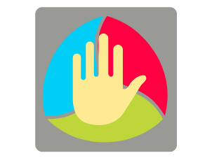

<div align="center">
    
</div>
<h1 align="center">Qt Hand Gesture App</h1>
<p align="center">An application for hand gesture classification</p>
<p align="center">
    <a href="">Watch Demo</a>
    ·
<a href="https://github.com/Mario-td/Qt-Hand-Gesture-App/issues">Request Feature</a>
    ·
    <a href="https://github.com/Mario-td/Qt-Hand-Gesture-App/issues">Report Bug</a>
</p>
<details open="open">
    <summary>Table of Contents</summary>
    <ol>
        <li>
            <a href="#about-the-project">About the Project</a>
            <ul>
                <li><a href="#technologies">Technologies</li>
            </ul>
        </li>
        <li>
            <a href="#getting-started">Getting Started</a>
            <ul>
                <li><a href="#prerequisites">Prerequisites</li>
                <li><a href="#build">Build</li>
            </ul>
        </li>
        <li><a href="#references">References</a></li>
        <li><a href="#licence">License</a></li>
    </ol>
</details>

<h2 id="about-the-project">About the Project</h2>

<br>
<div align="center">
    <a href="google.com"></a>
</div>
<br>
<p>This project is created to record a user's gesture with one hand and figure out which gesture was performed.</p> 
<p>The main motivation is to approach the challenge of human activity recognition, in particular hand gestures, which can be used as commands for human-computer interaction.</p>
<p>The following tasks were conducted to make this project:</p>
<ul>
    <li>Building a custom dataset with more than 3,700 gestures with the contribution of 7 people</li>
    <li>Data cleaning and data augmentation applying spatio-temporal transformations</li>
    <li>Training and fine-tunning a deep neural network model from scratch using the 2D hand keypoint location data, covered <a href="https://github.com/Mario-td/Hand-Gesture-Classification-with-Tensorflow-2.0">here</a></li> 
    <li>Building a program to record the gestures and perform the inference, also covered <a href="https://github.com/Mario-td/Inference-for-Hand-Gesture-Classification">here</a></li>
    <li>Creating a user-friendly GUI </li>
</ul>

<h3 id="technologies">Technologies</h3>

<ul>
    <li><a href="https://www.qt.io/download">Qt 5.14.1</a></li>
    <li><a href="https://github.com/opencv/">OpenCV 4.0.0 </a>(with CUDA)</li> <li><a href="https://pytorch.org/">LibTorch</a> (with CUDA)</li> </ul> <h2 id="getting-started">Getting Started</h2> 
<h3 id="prerequisites">Prerequisites</h3>

<p>Make sure to get the compatible NVIDIA drivers and libraries, the following toolkit and library are needed:</p>

<ul>
    <li><a href="https://developer.nvidia.com/cuda-downloads">CUDA 10.1+</a></li>
    <li><a href="https://developer.nvidia.com/cuDNN">CuDNN 7.6+</a></li> 
</ul>

<h3 id="build">Build</h3>

Clone this repository
```shell
git clone https://github.com/Mario-td/Qt-Hand-Gesture-App.git 
cd Qt-Hand-Gesture-App
```

Build the executables
```shell
cmake -DCMAKE_PREFIX_PATH=/path/to/libtorch .
make
```

Run the application
```shell
./Qt-Hand-Gesture-App
```
